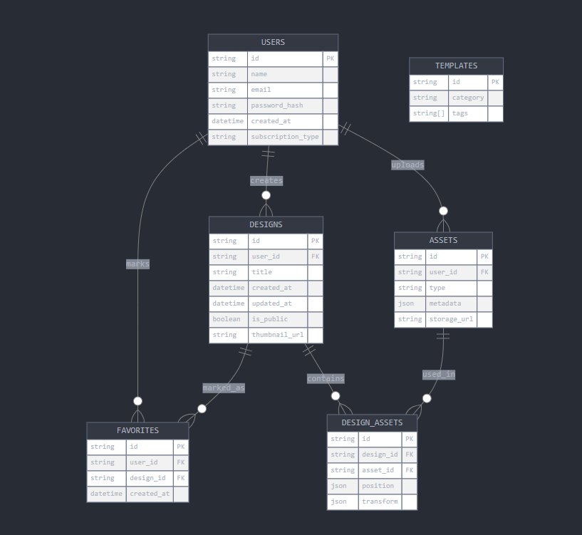
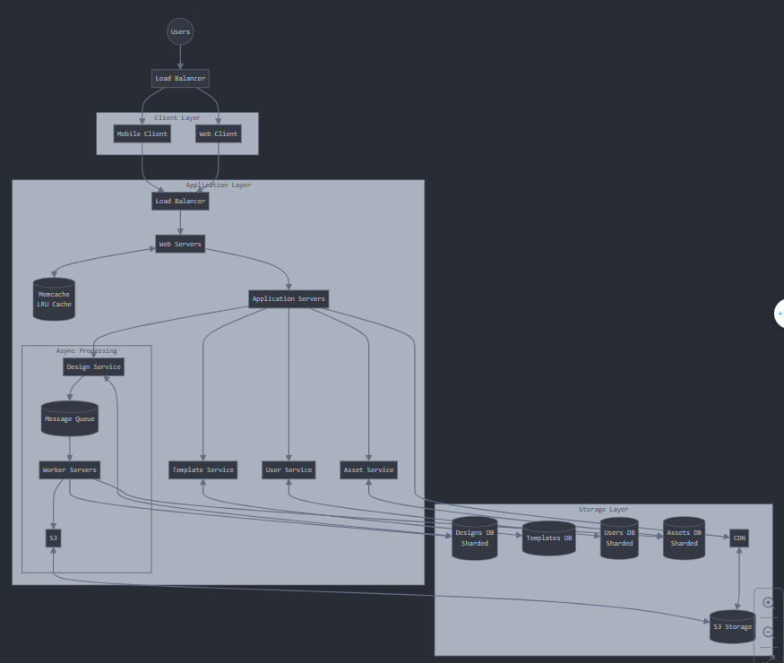

# Vocabulary
- For the sake of something: Vì lợi ích của cái gì đó.
- Time-consuming tasks: Các task tốn nhiều thời gian.
- 
# Canva
# What is Canva
- Canva is a cloud-based graphic design platform. Cho phép users có thể tạo các bài thuyết trình, các mẫu thiết kế truyền thông trên mạng xã hội, posters, and more.
- Launched in 2013, it has gained popularity due to its user-friendly interface, extensive library of templates and a rich set of design tools.
# Important Features
- User-friendly interface
- Template library: offering extensive collection of designed templates for various purposes, saving time and effort for users.
- Design tools: Provides a range of editing tools, include drag-and-drop functionality, images filters, text-editing and more
- Collaboration: Collaborate in real-time, allowing teams to work together on design project efficiently.
- Integration: Integrates with other platforms and applications
# Scaling Requirements - Capacity estimation
- Simulate a small-scale scenario for Canva with the following assumptions:
    + Total number of users: 100 Mil
    + Daily active users: 20 mil (DAU)
    + Number of design created by user/day: 2
    + Number of design created per day: 20 * 2 = 40 Mil design/day
    + Since the system is read-heavy, let's assume the read-to-write ratio as 100:1 
    + Total number of designs uploaded per day: 1/100 * 40 Mil = 400.000 design/day
- Storage estimation
  + Assuming that on average each design size is 5MB 
  + Total storage per day: 400.000 * 5 = 2.000 GB/day
  + For the next 5 years: 2.000 * 5 * 365 = 3.65 PB
  + Request per second: 40 Mil / (3600 seconds * 24) = 462 requests/second
# Data model - ER requirements 
  + Users -> id, name, email, password, created_at, subscription_type
  + Designs -> id, user_id, title, date, created, updated_at, is_public, thumbnail_url
  + Templates -> id, category, tags
  + Assets -> id, user_id, type (image, video, vector), metadata
  + Favorite -> id, user_id, design_id, created_at

# High level design
  + Web servers: Handle user requests, manage sessions, and serve static content.
  + Application servers: Process design creation, editing and template rendering
  + Database servers: Store user data, designs, templates and other relevant information.
  + Database sharding: Partitioning the database to distribute data across multiple servers to handle large data volumes efficiently. 
  + Caching: Utilizing caching mechanisms to reduce database load and i~~~~mprove response times for frequently accessed data.
  + Asynchronous Processing: Implementing queues and workers for time-consuming tasks like image processing and email notifications.
# Assumptions
  + There will be more reads than writes, so the system needs to be designed as a read-heavy system.
  + System should be scaled horizontally (scale-out)
  + Highly available
  + Availability and reliability are more important than consistency.
  + Read-heavy because the users view designs more than they upload designs.
# Main components:
  + `Mobile client`: Mobile devices
  + `Application server`: Responsible for handling read, write and notification requests. 
  + `Load balancer:` Routes and directs the request to the appropriate servers that perform the designated services.
  + `Cache (Memcache):` A caching system to serve millions of users quickly. Caches data based on Least Recently Used (LRU) to improve efficiency.
  + `CDN`: Content Delivery Network to improve latency and throughput, serving static content like images and designs
  + `Database`: Using NoSQL database to store user data, design metadata, likes, comments, and follows.
  + `Storage Object:` S3 to upload and store the actual design images.
# API Design
  + /users -> POST, GET, PATCH, DELETE
  + /designs -> POST, GET, DELETE
  + /users/{user_id}/feed -> GET 

