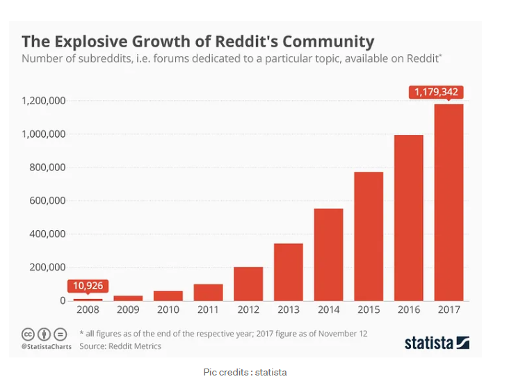
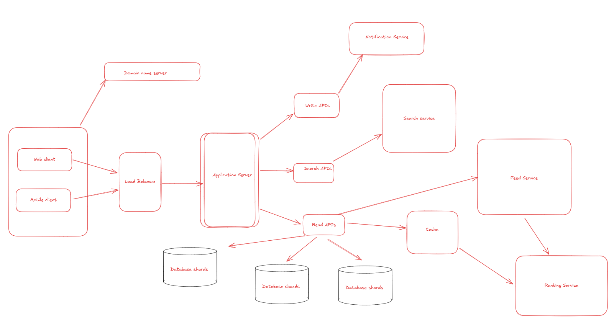

# Reddit: 
- Reddit is a social forum and news website which lets users —
    + Create posts
    + Vote — Upvote/downvote
    + Engage with posts with Comments or awards or share or report
    + Search the post or reddit community
    + Submit or share links/pictures/text
    + Create Community rules
    + Advertise your product
    + Save your favorite posts
    + Create tags based on the content posted like OC ( Original Content), Spoiler, Flair etc
# To design Reddit you would need consider the following term:
- `Login & Registration`
- Subreddit creation and management.
- `Content submission and voting`
- `Commenting`
- `Moderation` (Kiểm duyệt) --> keep the website free of spam and inappropriate content. 
- `Search and discovery`
- Analytics: To measure the performance of the website and make data-driven decisions --> application would need to include an analytics system to traffic and other metrics.

# Important features:
- Create posts
- Search posts
- Engage with posts ---> Comment or voting, share or reports. 

# Calculation:
+ Daily active user (DAU): 20 triệu users
+ Số posts trong trang homepage: 10 posts
+ Số lần truy cập của 1 người mỗi ngày: 3 lần
----> Số lượng truy cập của toàn bộ người dùng trong 1 ngày: 20 Million * 3 = 60 Million/day
----> For all 10 posts: 60 Mil * 10 = 600 Mil.

# For Posts
- Post title be 30 characters ---> `30 * 3bytes/character = 90bytes`
- FYI: (về kích thước characters: 
    - UTF-8 (Unicode Transformation Format - 8 bit):
        + Là mã hóa biến độ dài (variable-length encoding):
        + 1 byte cho các ký tự ASCII (0–127).
        + 2 bytes cho các ký tự mở rộng (ví dụ: ký tự Latin có dấu như "é", "ê").
        + 3 bytes cho hầu hết các ký tự trong các ngôn ngữ như tiếng Việt, tiếng Hán, Hàn, Nhật.
        + 4 bytes cho các ký tự hiếm, biểu tượng, emoji, hoặc ký tự đặc biệt.)
- Comments be `4 bytes`
- Date of post be `8 bytes` (1 timestampt thường là 8bytes trong hệ thống 64bit)
- Text be `500 characters` so thats `500 characters * 2bytes/characters = 1000bytes.`
- Images be 200KB
- Total = 4KB 
-----> Total storage per day: 600Mil * 4KB = 2.4TB/day
For next 3 years: 2.4 * 3 * 365 = 2.62TB

# Data Model 
- User (id: Int, username: string, password: string, status: Timestamp) -> ``Create``, ``engage`` with other posts, ``login`` and ``maintain`` session
- Post(id: Int, title: string, user_id: Int, url: string, date: Timestamp) -> ``User`` should be able to ``create posts`` (can be text, image, video), ``Post`` should have ``timestamp and url``.
- Comment(id, user_id, post_id: Int, comment_text: string) -> ``User`` can ``comment`` in different posts.
- Vote(id, user_id, post_id, comment_id: Int, vote_type: string) -> ``User`` can ``upvote/downvote`` posts as other users comments. Vote ``contribute towards the ranking of posts.``

# Hight level design 
- System should be highly reliable and available
- System is read heavy ---> Query data nhiều và liên tục.
- System should have both mobile and web application 
- System should be able to handle huge amount of data (text, images, videos)
- System should be scaled horizontally.
- Consistency and availability:

# Components: 
- Client: Web users, mobile
- Application servers: Should be able to talk each other
- Load balancers: To allocate requests to proper application servers using consistent hashing
- Database: Cassandra db or Hbase Key-value stores allows for great horizontal scaling and low latency to access data. HBase is a column-base key-value NoSQL database.
- Sessions service: To store the session information of the different users.
- Cache to get data (read heavy)
- Media Storage: S3 to store videos/images
- CDN
- Notification service: To push notifications to the users when the status is offline.

# Services
- Session service ---> To store the sessions information of different users have both mobile and web interface
- Post Service ---> To create and stores the posts by the users
- User Profile service ---> To store users profile information and keep updating
- Notification service: ---> To push notifications
- Feed Service ---> To create and store feed for the users
- Ranking service ---> To rank the posts (based on which the feed is created)
- Search Service ---> To handle search functionality.

# Low level design
- Define OOP design for this system

# API design
- We will define 5 endpoints for our Reddit API
+ 1. GET /api/v1/posts: Returns a list of all posts in the database
+ 2. GET /api/v1/posts/:id: Return a specific post by its ID
+ 3. POST /api/v1/posts: Adds a new post to the database
+ 4. PUT /api/v1/posts/:id: Updates a specific post by its ID 
+ 5. DELETE /api/v1/posts/:id: Delete a specific posts by its ID

